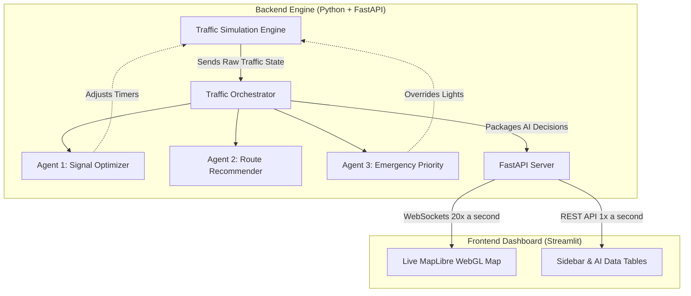

# 🎓 TRAFFICQ AI: Comprehensive Dashboard & Architecture Guide

Welcome! This document is designed to help you explain **TRAFFICQ AI** to an examiner or a stakeholder who has no prior knowledge of the project. 

Think of this project as a **"Smart City Command Center"**. We have built a simulated city grid, and instead of using basic timers for traffic lights, we are using multiple AI Agents to monitor, optimize, and reroute traffic in real-time.

---

## 🏗️ 1. The Big Picture: How Data Flows

Before looking at the dashboard, it is crucial to understand the backend architecture. The project is separated into a **Backend Engine** and a **Frontend Dashboard**.

**What is happening here?**
1. The **Simulation Engine** mathematically moves vehicles around a 2x2 grid.
2. The **Traffic Orchestrator** pulls data from the engine and feeds it to three separate AI agents.
3. The **API Server** bundles the simulation data and the AI agents' decisions, sending it to the frontend via high-speed WebSockets.
4. The **Dashboard** (what the user sees) simply reads this data and renders it beautifully.

---

## 🗺️ 2. The Main Map View

The center of the dashboard is the **Live Map**. This isn't just a video; it is a live HTML/WebGL render powered by WebSockets. 

### What are you looking at?
- **Blue Dots:** Civilian vehicles driving on the grid.
- **Intersection Overlays (The Black Boxes):** At each of the 4 intersections, there is a data box.
  - **Where it comes from:** The `api/app.py` file calculates these metrics based on the physical positions of the cars.
  - **What it shows:** 
    - **Split:** How much Green Light time the North/South roads get vs East/West roads.
    - **Vehicles / Wait:** The number of cars near the intersection and their average wait time.
    - **Congest %:** A color-coded congestion percentage.
- **Why we use it:** To prove to the examiner that our AI isn't just a black box. You can physically watch a congested intersection dynamically increase its Green Light time to clear a traffic jam!

---

## 📊 3. The Top Performance Metrics (KPIs)

At the very top of the dashboard, you will see key performance indicators:
- **Total Vehicles & Avg Wait:** A quick pulse check of the city.
- **Congestion:** The overall gridlock percentage.
- **Optimization (+%) [Green Text]:** 
  - **What it is:** This shows how much faster traffic is moving compared to standard "dumb" traffic lights.
  - **Where it comes from:** The backend calculates the baseline wait time for static timers and compares it against our AI's current adaptive wait time.

---

## 🧠 4. The AI Agent Data Tables (Right Column)

The dashboard exposes the "thoughts" of our three AI agents. Here is how to explain them:

### 🚦 Agent 1: Intersection Metrics (Signal Optimization)
* **What the table shows:** A row for each of the 4 intersections (NW, NE, SW, SE). It shows the current active Phase (e.g., North/South is Green) and the exact Green Time (in seconds) allocated to each direction.
* **How it works:** If the North road has 20 cars waiting and the East road has 2 cars, Agent 1 mathematically calculates that North deserves 90% of the green time for the next cycle.
* **Why it matters:** This represents **Adaptive Traffic Control**. It proves the system reacts to real-world demand rather than hardcoded timers.

### 🗺️ Agent 2: Route Recommendations
* **What it shows:** Text advisories (e.g., "🔴 HIGH Congestion on EB_top: Recommend diversion").
* **How it works:** Agent 2 looks at entire "corridors" (full streets, not just single intersections). If a street hits >70% congestion, it triggers an alert.
* **Why it matters:** This mimics modern GPS apps like Google Maps. It acts as a city-wide advisory system.

### 🚨 Agent 3: Emergency Priority (The Star Feature)
* **What it shows:** When you dispatch an ambulance from the sidebar, this panel lights up. It shows the calculated path, the ETA, and eventually, the **Time Saved**.
* **How it works:** 
  1. Agent 3 calculates the fastest physical route through the city.
  2. It paints a **Green Corridor** on the map.
  3. It violently overrides the traffic lights (forcing them Green) as the ambulance approaches, ensuring it never stops.
* **Why it matters:** This is the most visually impressive feature for an examiner. It demonstrates absolute priority routing and immediate system intervention.

---

## 🎛️ 5. The Sidebar Controls (Left Column)

The sidebar is where you (the user) play "God" with the simulation.

* **▶ Apply / Reset:** Click this to sync the dashboard with the background engine.
* **Traffic Density Sliders:** 
  - **How to use them:** Drag a slider to 100% and click Apply. You will instantly see a massive influx of cars on that specific road. 
  - **What to show the examiner:** Jack up the North/South traffic to 100%, and leave East/West at 10%. Point out how Agent 1 notices this and immediately gives the North/South traffic massive green lights, completely solving the traffic jam!
* **Emergency Dispatch:** Select a lane, pick "Ambulance", and hit Dispatch. Watch the map draw the route and clear the path.

---

## 💬 6. The LLM AI Assistant (Chatbot)

At the bottom of the sidebar, there is a text box labeled **"Ask TRAFFICQ AI a question..."**

* **Where it comes from:** This connects to an advanced Large Language Model (like OpenAI/GPT) through the LangChain framework. 
* **How it works:** When you ask a question, the backend gathers all the current data (number of cars, wait times, signal splits) and sends it to the LLM as context. The LLM reads the data and generates a human-like response.
* **Questions to ask the examiner:**
  1. *"Which intersection currently has the worst traffic?"*
  2. *"Why is the ambulance taking the bottom route instead of the top?"*
  3. *"Summarize our current optimization performance."*

---

## 🎯 Summary: The "Elevator Pitch" for the Examiner

> *"Examiner, what you are looking at is a fully decoupled, real-time smart city simulation. We have a backend physics engine pushing data over WebSockets to a MapLibre WebGL frontend at 20 frames per second. Instead of hardcoded rules, we utilize a multi-agent system: Agent 1 micromanages traffic lights based on queue lengths, Agent 2 manages city-wide routing advisories, and Agent 3 dynamically charts green corridors for emergency vehicles by overriding physical signals. Everything is tied together with an LLM that allows city planners to chat directly with the city's infrastructure."*
