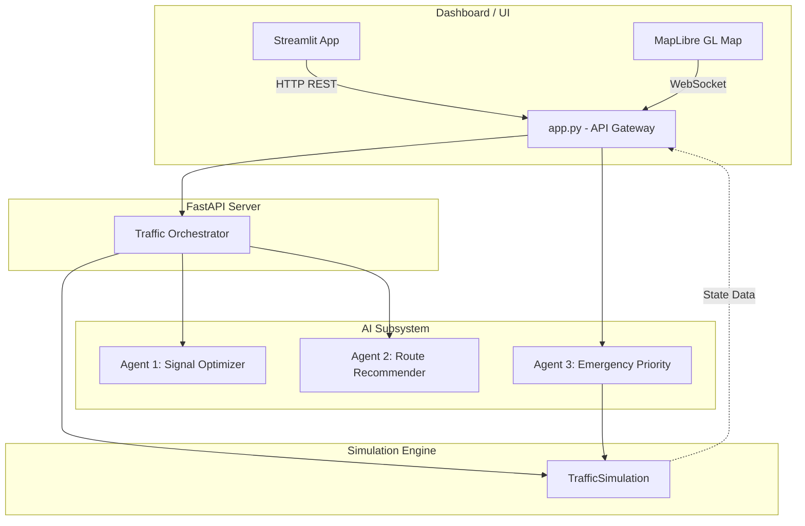
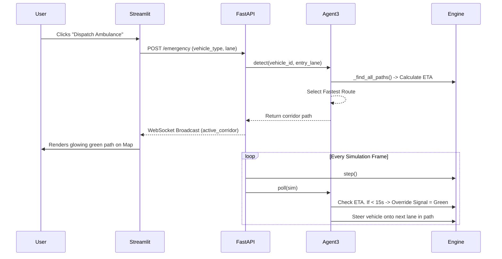

# 🚦 TRAFFICQ AI: System Architecture & Data Flow

Welcome to the **TRAFFICQ AI** deep dive. This document explains exactly how the multi-agent traffic simulation system works, the purpose of each file, and how the different AI agents collaborate in real-time to optimize traffic and route emergency vehicles.

---

## 1. High-Level Architecture

The project follows a **decoupled client-server architecture** built on Python. It consists of three primary layers:
1. **The Simulation Engine**: A mathematical model of a 2x2 city grid with vehicles and traffic lights.
2. **The AI Agent Subsystem (FastAPI)**: A REST/WebSocket server that hosts the intelligent agents processing the simulation data.
3. **The Live Command Center (Streamlit)**: A premium front-end dashboard featuring a MapLibre integration to visualize the simulation and agent decisions.



---

## 2. Project Directory Structure & File Significance

Here is a breakdown of what every file in the repository does:

```text
trafficq_ai/
├── api/
│   ├── app.py             # The FastAPI server. Manages the simulation loop, agent execution, and WebSocket data broadcasting.
│   └── models.py          # Pydantic schemas defining the data shapes (e.g., VehiclePosition, StepResponse) for the API.
├── agents/
│   ├── orchestrator.py    # The central brain that coordinates Agent 1 and Agent 2, occasionally calling an LLM for complex text analysis.
│   ├── signal_optimizer.py# Agent 1: Calculates queue lengths and suggests green light durations for intersections.
│   ├── route_recommender.py# Agent 2: Monitors corridor congestion and issues traffic diversion advisories for civilian vehicles.
│   └── emergency_priority.py# Agent 3: Detects emergency vehicles, finds the fastest route, overrides traffic lights, and physically steers the vehicle.
├── simulation/
│   └── engine.py          # The core physics and state engine. Models lanes, vehicles, speeds, and traffic light phases.
├── dashboard/
│   └── app.py             # The Streamlit application. Contains the premium MapLibre HTML component and the data KPIs.
├── main.py                # A CLI entry point to easily launch the API or run tests.
└── requirements.txt       # Python package dependencies (FastAPI, Streamlit, Uvicorn, etc.)
```

---

## 3. How the AI Agents Work

The system relies on three specialized agents working concurrently.

### 🟢 Agent 1: Signal Optimizer (Micro-management)
**Goal:** Prevent long queues at individual intersections.
* **How it works:** Every few seconds, it looks at the queue lengths in the North-South and East-West lanes at every intersection.
* **Logic:** If the North-South queue is twice as long as the East-West queue, it will assign twice as much "Green Time" to the North-South phase during the next traffic light cycle.

### 🟡 Agent 2: Route Recommender (Macro-management)
**Goal:** Balance traffic load across the entire city grid.
* **How it works:** It analyzes total congestion across full "corridors" (e.g., the entire top East-West road).
* **Logic:** If a corridor exceeds 70% congestion, it triggers a `HIGH` severity alert and recommends diverting a percentage of civilian traffic to an alternate route, acting like a city-wide GPS advisory system.

### 🔴 Agent 3: Emergency Priority (Absolute Override)
**Goal:** Get an ambulance/firetruck/police car to its destination as fast as possible.
* **How it works:** When an emergency vehicle is dispatched, it calculates every possible physical path through the grid.
* **Logic:** 
  1. It uses real-time congestion data to calculate an Estimated Time of Arrival (ETA) for each path.
  2. It selects the fastest path (the "Green Corridor").
  3. As the emergency vehicle approaches an intersection on this path, Agent 3 forcefully overrides the traffic light, holding it green until the vehicle passes.
  4. It sends a `HOP_TO_LANE` command to physically steer the vehicle along the chosen route.



---

## 4. The Data Flow: How the Map Works

The most visually impressive part of the system is the MapLibre integration in the dashboard. Here is how the dots actually move on the map without lagging:

1. **The Backend Loop:** The `app.py` FastAPI server runs a background task (`_simulation_loop`) that ticks the `TrafficSimulation` engine forward 20 times a second (20fps).
2. **Translation to Geography:** In `app.py`, the `_vehicle_to_geo()` function looks at a vehicle's logical position (e.g., "50% of the way down the Northbound Lane") and translates it into physical Latitude and Longitude coordinates mapped to New York City.
3. **The WebSocket Stream:** Every frame, a massive JSON payload containing the exact Lat/Lon of every vehicle, the signal states, and the emergency path is streamed over a WebSocket connection to the browser.
4. **The Frontend Render:** The Streamlit app embeds a custom HTML/JavaScript block. The JavaScript intercepts the WebSocket stream and updates the MapLibre `GeoJSON` sources. Because this bypasses Python entirely on the frontend, the vehicles glide smoothly across the screen without forcing the Streamlit page to reload.

> [!TIP]
> **To start the project:**
> 1. Run the API: `python main.py api`
> 2. Run the Dashboard: `python -m streamlit run dashboard/app.py`
> 3. Open `http://localhost:8501` and click **▶ Apply / Reset** in the sidebar.

---
*Generated by Antigravity AI*
