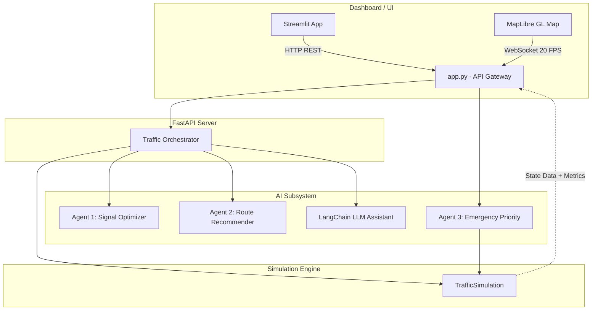

# 🚦 TRAFFICQ AI: System Architecture & Data Flow

Welcome to the **TRAFFICQ AI** deep dive. This document explains the exact technical architecture, data flow, and multi-agent coordination system that powers the traffic simulation and dashboard.

---

## 1. High-Level Architecture

The project follows a **decoupled client-server architecture** built on Python. It consists of three primary layers:
1. **The Simulation Engine**: A mathematical model of a 2x2 city grid with vehicles and traffic lights.
2. **The AI Agent Subsystem (FastAPI)**: A REST/WebSocket server that hosts the intelligent agents processing the simulation data.
3. **The Live Command Center (Streamlit)**: A premium front-end dashboard featuring a MapLibre integration to visualize the simulation, node-level metrics, and agent decisions.



---

## 2. Project Directory Structure & File Significance

Here is a breakdown of what every file in the repository does:

```text
trafficq_ai/
├── api/
│   ├── app.py             # FastAPI server. Manages simulation loop, agents, WebSocket data broadcasting, and per-node metrics computation.
│   └── models.py          # Pydantic schemas (VehiclePosition, StepResponse, IntersectionDetail, EmergencyStatusData).
├── agents/
│   ├── orchestrator.py    # Central brain coordinating Agent 1 & Agent 2, interfacing with LangChain/OpenAI.
│   ├── signal_optimizer.py# Agent 1: Calculates queue lengths and suggests optimal green light durations.
│   ├── route_recommender.py# Agent 2: Monitors corridor congestion and issues traffic diversion advisories.
│   └── emergency_priority.py# Agent 3: Detects emergency vehicles, calculates ETAs, overrides traffic lights, and physically steers vehicles.
├── simulation/
│   └── engine.py          # Core physics engine. Models lanes, vehicles, speeds, and traffic light phases.
├── dashboard/
│   └── app.py             # Streamlit application containing the MapLibre HTML component, AI data tables, and dynamic emergency banners.
├── scripts/               # Utility scripts (e.g., check_imports.py).
├── main.py                # CLI entry point to launch the API or Dashboard.
└── requirements.txt       # Python package dependencies.
```

---

## 3. How the AI Agents Work

The system relies on three specialized agents working concurrently, alongside an LLM chatbot.

### 🟢 Agent 1: Signal Optimizer (Micro-management)
**Goal:** Prevent long queues at individual intersections.
* **How it works:** Periodically scans queue lengths in the North-South and East-West lanes at every intersection.
* **Logic:** If the North-South queue is heavily congested compared to East-West, it assigns a higher percentage of "Green Time" to the North-South phase.
* **Output:** Translates to live `ns_green` and `ew_green` metrics overlaid on the MapLibre nodes.

### 🟡 Agent 2: Route Recommender (Macro-management)
**Goal:** Balance traffic load across the entire city grid.
* **How it works:** Analyzes total congestion across full "corridors" (e.g., the entire top East-West road).
* **Logic:** If a corridor exceeds 70% congestion, it triggers a `HIGH` severity alert and recommends diverting civilian traffic to an alternate route.

### 🔴 Agent 3: Emergency Priority (Absolute Override)
**Goal:** Guarantee the fastest possible route for first responders.
* **How it works:** When an emergency vehicle is dispatched, it calculates the ETA for every possible physical path through the grid using live congestion data.
* **Logic:** 
  1. Selects the fastest path (the "Green Corridor").
  2. Forcefully overrides traffic lights (holding them green) as the vehicle approaches.
  3. Sends `HOP_TO_LANE` commands to physically steer the vehicle.
* **Output:** Broadcasts the active corridor path, ETA, textual explanation, and final Time Saved (%) back to the dashboard.

---

## 4. The Data Flow: Real-Time Map Rendering

The most visually impressive part of the system is the MapLibre integration. Here is how it achieves 20 FPS without lagging the Streamlit UI:

1. **The Backend Loop:** `api/app.py` runs a background task (`_simulation_loop`) that ticks the `TrafficSimulation` engine forward 20 times a second. It computes physics, fuel usage, per-node wait times, and optimization percentages.
2. **Translation to Geography:** Vehicles' logical positions (e.g., "50% down Northbound Lane") are translated into physical Latitude/Longitude coordinates mapped to a real-world city projection.
3. **The WebSocket Stream:** Every frame, a comprehensive JSON payload is sent over WebSockets. This includes:
   - Array of `vehicles` (Lat/Lon).
   - Array of `intersection_details` (Wait times, phase, congestion, splits).
   - `emergency_status` (Active corridor path for the red/green glowing line).
   - System KPIs (`optimization_pct`, `avg_wait_s`).
4. **The Frontend Render:** The Streamlit app embeds custom HTML/JavaScript. The JS intercepts the WebSocket stream, updates MapLibre `GeoJSON` sources, and dynamically manipulates HTML `div` elements for the intersection node labels. Because this bypasses Python entirely on the frontend, the visualization is buttery smooth.
